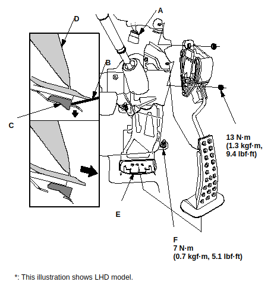
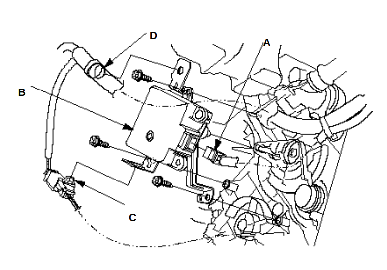
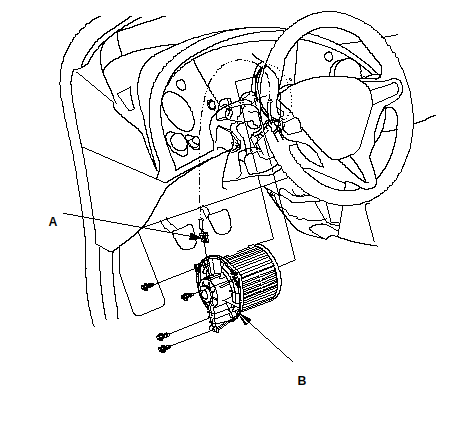

# Blower Motor Replacement

## Remove the front center console.
## Remove the accelerator pedal module.
- Disconnect the accelerator pedal module connector (A).
- Using flat-tip screwdriver (B), push the lock (C), then remove the accelerator pedal module (D).
- NOTE: APP sensor is not available separately. Do not disassemble the accelerator pedal module.
- If the pedal stop (E) is damaged, pull back the carpet, remove the nut (F), and replace the pedal stop.
- NOTE: Make sure that the accelerator pedal module is secure.

## Remove the air mix control motor.
- Disconnect the 3P connector (A) from the air mix control motor (B). Remove the connector clip (C), the harness clip (D), the self-tapping screws, and the air mix control motor from the heater unit.
- Install the motor in the reverse order of removal. Make sure the pin on the motor is properly engaged with the linkage. After installation, make sure the motor runs smoothly.

## Blower Motor Replacement
- Disconnect the connector (A) from the blower motor (B). Remove the self-tapping screws and the blower motor.
Install the motor in the reverse order of removal.

